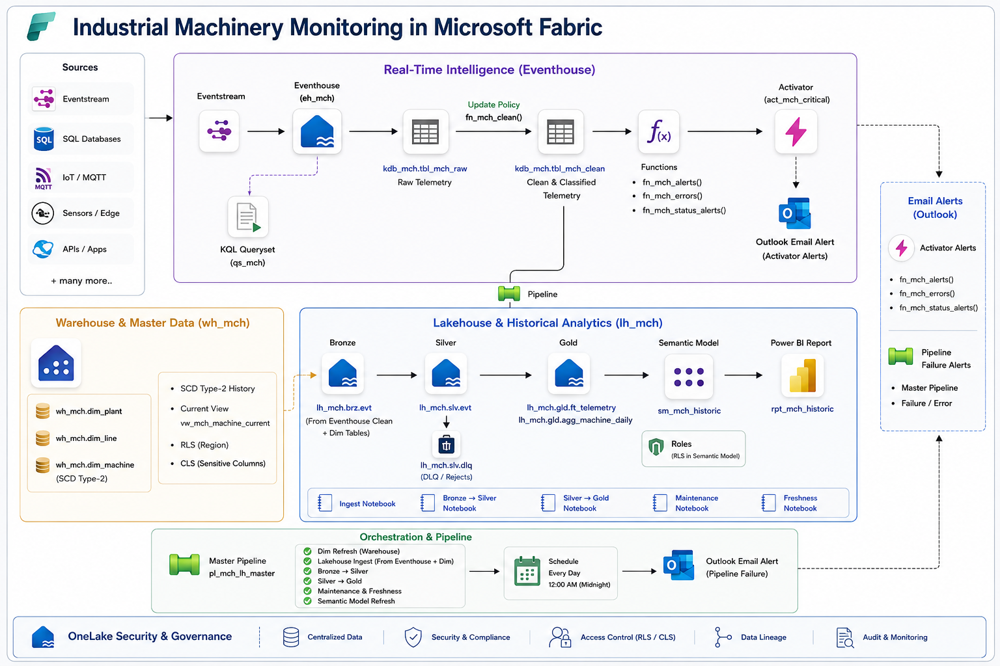

# ws_mch_iot — Industrial Telemetry

> Real-time monitoring meets historic analytics on Microsoft Fabric.



## Overview

`ws_mch_iot` transforms live machinery sensor data into operational intelligence and long-term business insights. The platform ingests high-velocity telemetry, classifies anomalies instantly, drives a live KQL dashboard, and builds a star-schema history for Power BI trend analysis.

---

## Architecture

### Hot Path (Eventhouse)
Live ingestion flows via Eventstream directly into a KQL database. An update policy cleans and classifies raw telemetry (`NORMAL` / `ALERT` / `ANOMALY` / `BAD` / `NULL`). Materialized views refresh a 10-tile operational dashboard, while alert functions trigger Activator email notifications on critical failures. All rejected records remain queryable for root-cause debugging.

### Cold Path (Lakehouse)
A scheduled incremental pipeline (daily 00:00 UTC) pulls cleaned data into a medallion lakehouse:
- **Bronze** — raw exports
- **Silver** — idempotent `MERGE` on `event_id` (with a dead-letter queue for stale or malformed data)
- **Gold** — joins to current master dimensions producing `ft_telemetry` and `agg_machine_daily` fact tables

Gold tables feed a Direct Lake semantic model for Power BI reports.

### Control Path (Warehouse)
Master reference data is maintained as SCD Type-2 dimensions for **10 plants**, **18 lines**, and **31 machines**. A current-state view (`vw_mch_machine_current`) abstracts SCD complexity. Security is demo-ready:
- **Row-Level Security** restricts operational users to APAC plants
- **Column-Level Security** hides commercial fields (`maintenance_cost`, `vendor_contact`)

---

## Orchestration & Execution

Three data pipelines orchestrate the batch workflows. All notebooks execute on the Python kernel (`deltalake`, `azure-kusto-data`, `pyodbc`), with production-grade Spark variants (V-Order, broadcast joins) provided as reference.

---

## End-to-End Lineage

```
tbl_mch_clean.machine_id → DIM_MACHINE → DIM_LINE → DIM_PLANT
```

Every telemetry record resolves through the above chain, ensuring full referential integrity across the entire platform.
